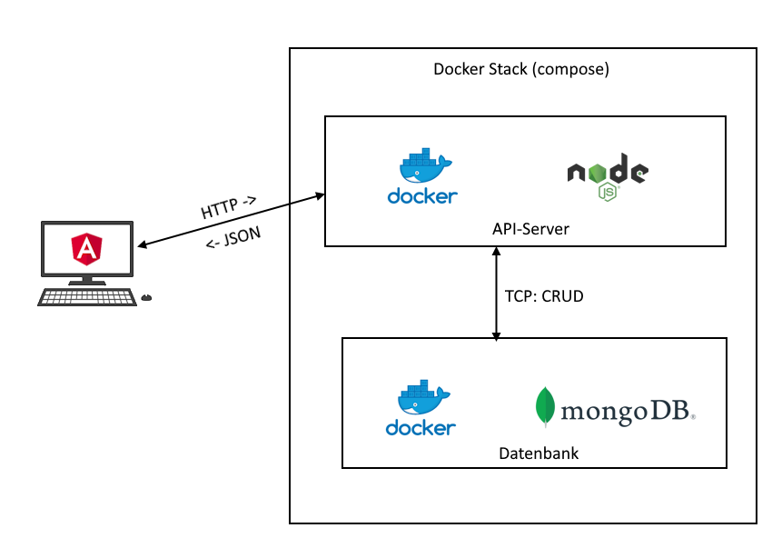
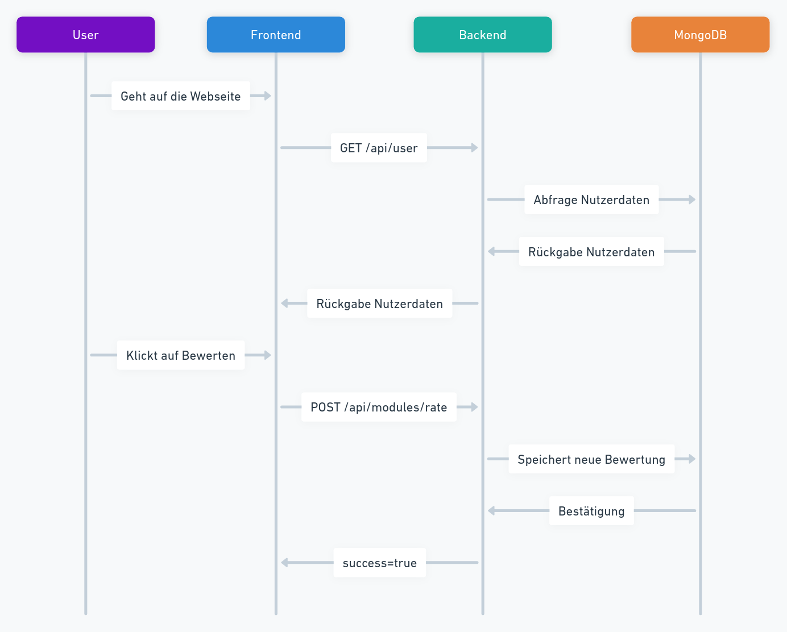

# Dokumentation

## Links
- [How to run](./Anleitung.md)
- [Arbeitsjournal](./Arbeitsjournal.md)
- [Projektbeschrieb](./Projektbeschrieb.md)
- [Fazit & Reflexion](./Fazit.md)
- [Online Version / Deployment](https://awesome-hslu.aboyobam.me/)

## Kontext
Awesome HSLU ist eine innovative Plattform, die Studierenden der Hochschule Luzern (HSLU) ermöglicht, ihre eigenen Erfahrungen, lustige Artikel sowie Modulbeschreibungen der Vorlesungen zu lesen, zu schreiben, zu zitieren und zu bewerten. Ziel ist es, das inaktive und veraltete GitHub-Repo von [Struggling At HSLU](https://github.com/struggling-at-hslu/observations/tree/master) zu ersetzen und den Studierenden einen alternativen und unterhaltsamen Einblick ins Studium zu bieten.

Es gibt vier wesentliche Funktionen der App:
- Erfassen von lustigen und überspitzten Modulbeschreibungen
- Erfassen von Artikeln
- Zitieren von Aussagen der Dozierenden
- Bewerten und kommentieren von allen Inhalten

Auf der Startseite werden trendige Inhalte gemäss den kürzlichen positiven Bewertungen angezeigt.

Die Seite wird provisorisch auf [awesome-hslu.aboyobam.me](https://awesome-hslu.aboyobam.me/) gehostet.

## Lösungsstrategie
### Architekturentscheide
Ich habe mich für den MEAN (**M**ongoose-**E**xpress-**A**ngular-**N**odeJS) Stack entschieden, weil ich mich bereits etwas mit NodeJS und Angular (bis Version ~7) auskenne.

Für die Datenbank habe ich MongoDB verwendet. Dabei verwende ich zum ersten Mal mongoose.

Ich wollte ursprünglich noch Server-Side-Rendering mit Angular Universal umsetzen, die wurde aber weggelassen, weil es zu kompliziert ist, dies nachträglich noch hinzuzufügen.

### Technologieentscheide
**TypeScript**: Sowohl der Client als auch der Server wurden in TypeScript erstellt. Bei Server wurde besonders darauf geachtet, dass jegliche Komponenten strikt typisiert wurden. \
Beim Client wurde das Typing aus Zeitgründen etwas vernachlässigt.

**Zod**: Für die Validierung der Nutzerdaten auf dem Server wurde [Zod](https://zod.dev/) verwendet um direkte Validation und Typ-Sicherheit zu haben.

**Mongoose**: Um die MongoDB mittels sogenannten Models zu Typisieren und das Handling zu vereinfachen wurde [Mongoose](https://mongoosejs.com/) eingesetzt.

**Bootstrap**: Um keine Stunden mit dem Styling zu verschwenden wurde [Bootstrap](https://getbootstrap.com/) in for von [ng-bootstrap](https://ng-bootstrap.github.io/#/home) eingesetzt.

**Docker**: Für das Deployment auf meinem Server habe ich die Applikation als Docker Container verpackt und sie auf meine Docker-Registry gepusht. Auf dem Server wurde eine Docker-Compose konfiguration erstellt, welche den Server und eine MongoDB startet.



## Bausteinsicht
**Client**: Frontend mit Angular \
**Server**: Backend mit NodeJS und Express. Aus einfachheit wurde `express.static` für die Statischen Dateien (Client) verwendet. Dies könnte aber einfach auf einen SFH (wie Nginx oder Apache) abgeändert werden. \
**Datenbank**: MongoDB \

### Client
Der Client hat 11 Seiten:
| Path | Funtion |
|------|---------|
| _(index)_ | Startseite mit dem trendigem Inhalt |
| /modules | Listet alle Modulbeschreibungen auf |
| /modules/new | Seite zum erfassen einer Modulbeschreibung |
| /articles | Listet alle Artikel auf |
| /articles/new | Seite zum erfassen eines Artikels |
| /quotes | Listet alle Zitate auf |
| /quotes/new | Seite zum erfassen eines Zitats |
| /login | Seite zum Einloggen |
| /register | Seite zum Registrieren |
| /forgot-password | Platzhalter Seite zum Password zurücksetzen (nicht umgesetzt) |
| /:type/:slug | Seite für details und Kommentare von Inhalten (Artikel, Modulbeschreibungen, Zitate) |

### Server
Der Server hat 14 Endpunkte:
| Path | Funtion |
|------|---------|
| GET /user | Gibt den aktuell eingeloggten Nutzer zurück |
| POST /login | Logt ein Nutzer ein |
| POST /register | Erstellt einen neuen Nutzer |
| POST /logout | Logt den aktuellen Nutzer aus |
| GET /modules/:type/:slug | Gibt Details für einen bestimmten Inhalt |
| POST /modules/:rate | Bewertet einen Inhalt |
| POST /modules/comment | Kommentiert einen Inhalt |
| GET /modules | Gibt alle Modulbeschreibungen zurück |
| POST /modules/new | Fügt eine neue Modulbeschreibung hinzu |
| GET /articles | Gibt alle Artikel zurück |
| POST /articles/new | Fügt eine neuen Artikel hinzu |
| GET /quotes | Gibt alle Zitate zurück |
| POST /quotes/new | Fügt eine neues Zitat hinzu |
| GET /trending | Gibt Modulbeschreibungen, Artikel und Zitate zurück, welche positiv bewertet wurden |

## Laufzeitsicht


## Verteilungssicht
Der Server und Client werden zusammen auf einem Server gehostet. Es könnte jedoch ohne Probleme umgestellt werden.

Der Client und Server kommunizieren mittels REST-Schnittstelle.

## Querschnittliche Konzepte
### Datenbank
Es gibt 4 Tabellen (aka. Collections) in der Datenbank.
**user**: Der Nutzer mit Username, Email, Salt und Passwort hash ab. \
**rating**: Eine Bewertung für ein Inhalt mit `positive` als boolean und einer UserID. \
**comment**: Ein Kommentar für ein Inhalt mit `text` und einer UserID. \
**module**: Ursprünglich gedacht als Tabelle für Modulbeschreibungen, jedoch aus Wiederverwendungszwecken auch für Artikel und Beschreibungen verwendet.
Beinhaltet eine Liste von `rating._id` mit Referenz auf Bewertungen und eine Liste von `comment._id` mit Referenz auf Kommentare.

Der Grund für diese etwas spezielle Speicherung mittels ObjectIDs ist weil MongoDB keine relationale Datenbank ist.

Es gibt aktuell keine Möglichkeit, die Daten über das UI zu löschen.

### Authentication
Es wird das Node Module `express-session` verwendet. Dieses setzt bei allen Nutzern (auch nicht eingeloggt) ein Session Cookie. Wenn sich ein Nutzer einloggt wird die ObjectID des Nutzers in die Session geschrieben (nur Serverseitig). Die SessionID von express-session dient als einmaliger Identifier um sicherzustellen, dass eine Person (auch ohne Login) jeden Inhalt maximal 1 Mal bewerten kann (Kann mittels Cookie löschen umgangen werden).

## Entwurfsentscheidungen
### Server-Side-Rendering
Es wurde kein SSR umgesetzt, obwohl dies nachträglich vermutlich sinnvoll wäre. Der Seiteninhalt ändert sich nicht mehr nach dem initialen Laden.

### Testing
Da der Client an sich keine wirkliche Logik beinhaltet, sondern nur die JSON Daten von der API visuell darstellt, wurde für den Client keine Unit-Tests erstellt. Dafür wurde jede Seite mit ausführlichen End-to-End Tests getestet.

Auf dem Server wurden alle wichtigen Endpunkte mit unit Tests getestet. Integrationstest wurden manuell gemacht, da die Zeit nicht reichte, um diese zu automatisieren. 

## Qualitätsanforderungen
### Error Handling
Bei jeder API-Anfrage wurde mit einem `try/catch` Block versehen, um sicherzustellen, dass der Nutzer auch informiert wird, wenn etwas nicht geklappt hat.

### Password Hashing
Die Passwörter werden auf der Datenbank nur gehasht abgespeichert. Dazu wird noch ein Salt verwendet, welcher bei jedem Nutzer einzigartig ist um die maximale Sicherheit zu gewährleisten.

### Mobile Kompatibilität
Die Webseite wurde für Desktop erstellt. Es wurde aber darauf geschaut, dass insbesondere mit Bootstrap auch eine gewisse Mobile Tauglichkeit entsteht.

## Tests
### Client
```
    Spec                                              Tests  Passing  Failing  Pending  Skipped
┌────────────────────────────────────────────────────────────────────────────────────────────────┐
│ √  articles.cy.ts                           00:01        3        3        -        -        - │
├────────────────────────────────────────────────────────────────────────────────────────────────┤
│ √  create-comment.cy.ts                     914ms        1        1        -        -        - │
├────────────────────────────────────────────────────────────────────────────────────────────────┤
│ √  home.cy.ts                               448ms        2        2        -        -        - │
├────────────────────────────────────────────────────────────────────────────────────────────────┤
│ √  login.cy.ts                              00:01        3        3        -        -        - │
├────────────────────────────────────────────────────────────────────────────────────────────────┤
│ √  logout.cy.ts                             565ms        1        1        -        -        - │
├────────────────────────────────────────────────────────────────────────────────────────────────┤
│ √  modules.cy.ts                            901ms        4        4        -        -        - │
├────────────────────────────────────────────────────────────────────────────────────────────────┤
│ √  new-module.cy.ts                         00:01        2        2        -        -        - │
├────────────────────────────────────────────────────────────────────────────────────────────────┤
│ √  quotes.cy.ts                             940ms        3        3        -        -        - │
└────────────────────────────────────────────────────────────────────────────────────────────────┘
  √  All specs passed!                        00:07       19       19        -        -        -
```

### Server
```
PASS  test/articles.test.js
PASS  test/auth.test.js
PASS  test/modules.test.js
PASS  test/comment.test.js
PASS  test/quotes.test.js
PASS  test/rate.test.js
                                                                                                                      
Test Suites: 6 passed, 6 total                                                                                        
Tests:       18 passed, 18 total
Snapshots:   0 total
Time:        4.363 s, estimated 5 s
Ran all test suites.
```